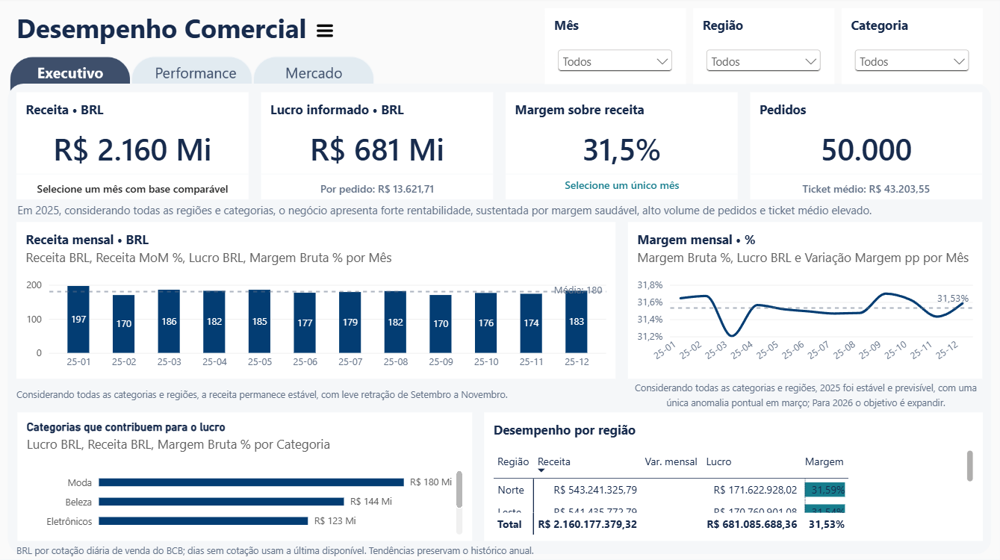
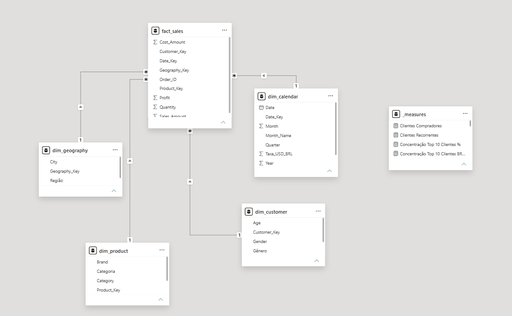
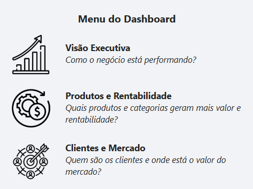
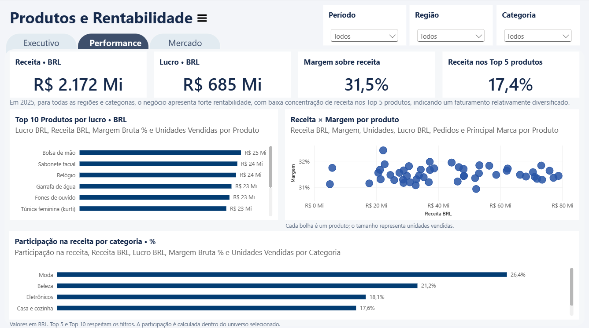
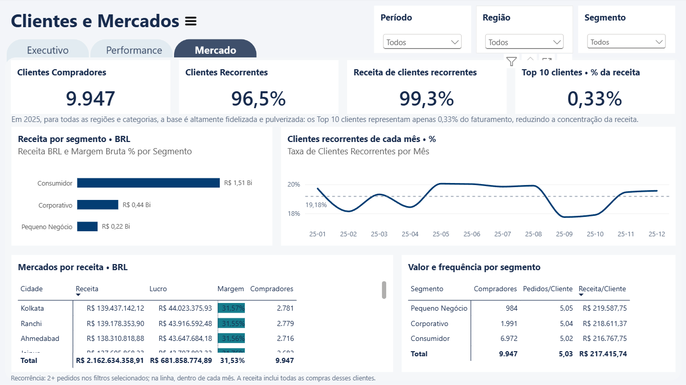

# E-Commerce Sales Executive Dashboard

> Executive Power BI solution for monitoring sales performance,
> product performance and profitability.
> The dashboard was developed using Power BI Desktop with PBIP source control,
> DAX, Power Query and dimensional data modeling.
> For presentation purposes, monetary values were converted to Brazilian Reais (BRL) using
> exchange rates from the Central Bank of Brazil (BCB), and the dashboard content was
> translated into Portuguese.

## 📊 Dashboard Preview

## 🎯 Project Overview

This project presents an executive Power BI dashboard designed
to provide a consolidated view of e-commerce sales performance
and support data-driven business analysis.

## 💼 Business Questions

- How is overall sales performance evolving?
- Which products and categories are driving revenue?
- Which products generate the highest profitability?
- How do recurring customers behave over time?
- Where are the main performance opportunities?

## 🏗️ Data Model

## 📈 Dashboard Pages

### Dashboard Menu

### Executive Overview

### Performance

### Market

## 💡 Key Business Insights

- Strong and stable profitability: R$2.16B in revenue, R$681M in profit and a 31.5% margin, with relatively stable monthly revenue throughout 2025. The revenue decline observed between September and November was primarily driven by the Fashion category in the South region.
- Diversified and balanced portfolio: Top 5 products represent only 17.4% of revenue, while margins remain consistently around 31–32% across products. Prioritize high-margin products and categories to increase profitability while maintaining portfolio diversification.
- High loyalty and low concentration: 96.5% of customers are recurring, generating 99.3% of revenue, while the Top 10 customers account for just 0.33% of total revenue. Small Business has the highest revenue per customer, suggesting an opportunity to expand this segment while maintaining its higher customer value.

## 🛠️ Tools & Technologies

- Power BI
- DAX
- Power Query
- Data Modeling
- Git / GitHub
- DAX Studio

## 📊 Explore the Report

[🔗 View the Interactive Report](https://app.powerbi.com/groups/me/reports/3532b848-1f71-43a7-ad52-81e25d8ee5fc?ctid=8b6c959c-d7c4-406c-9e6b-cac0b71de24e&pbi_source=linkShare)

## 📚 Data Source

- [E-Commerce Sales Data Warehouse — Kaggle](https://www.kaggle.com/datasets/akashmailapalli/e-commerce-sales-data-warehouse?resource=download)

## 👤 Author
Katherine Costa
